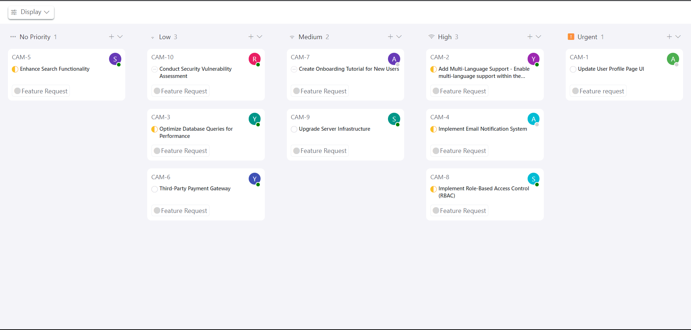
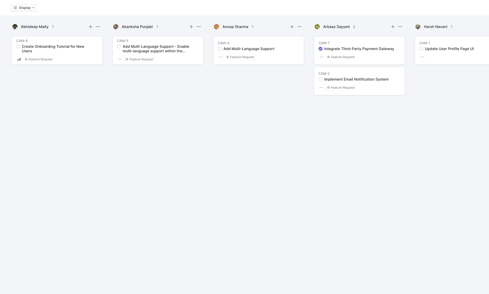
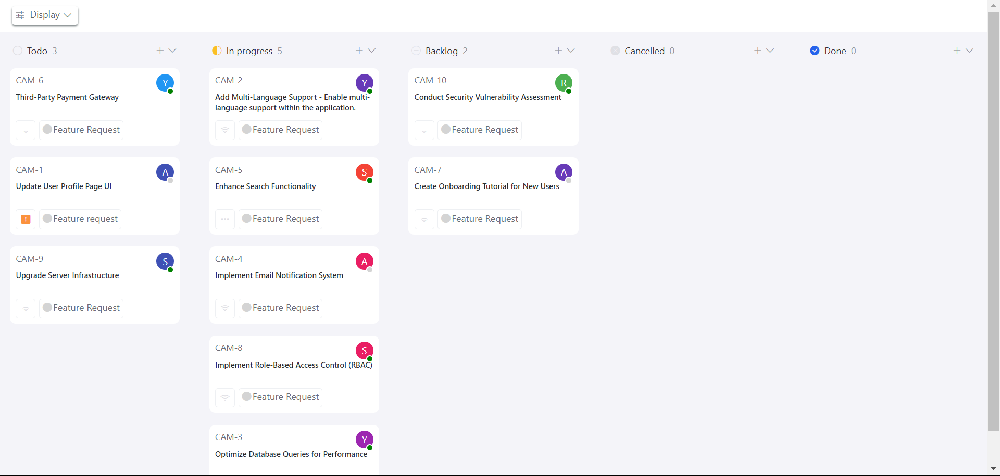
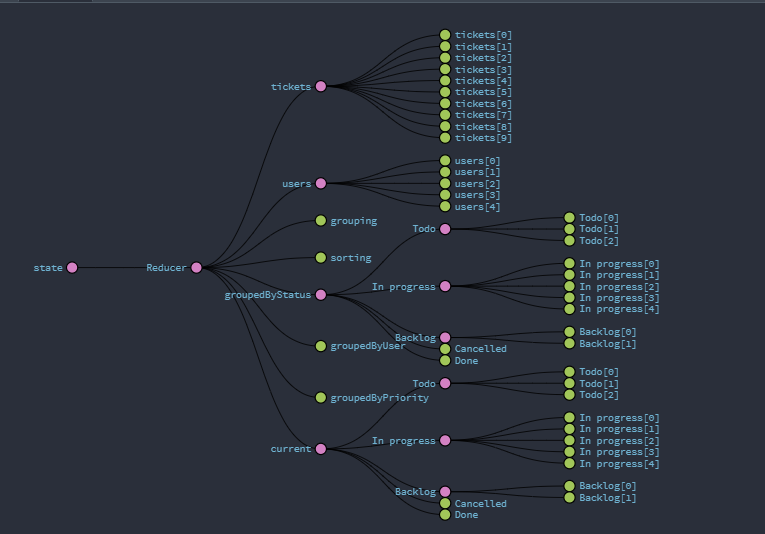
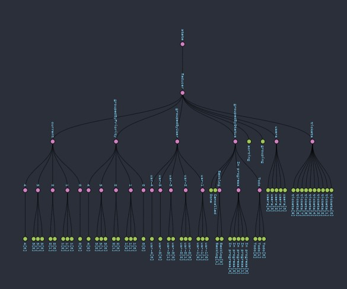
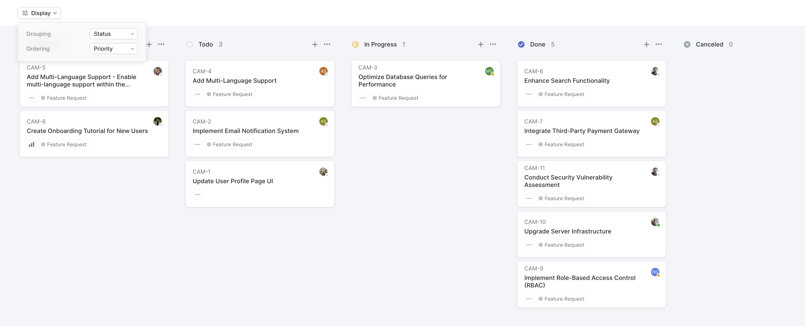
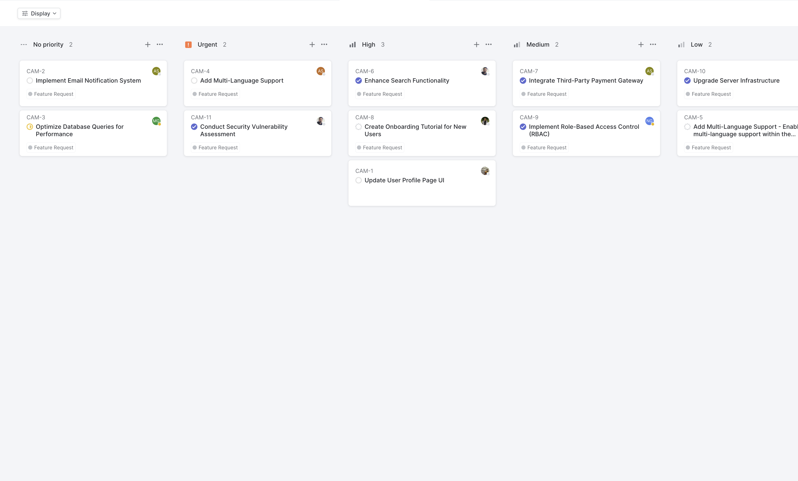
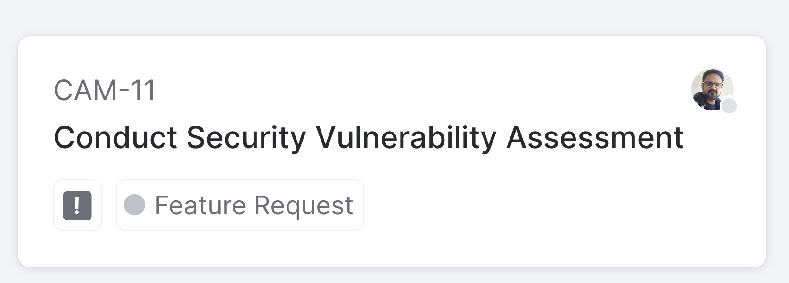

# Solution : Kanban Board
### Display State
### Grouping by priority is selected.

### Grouping by user is selected.

### Grouping by status is selected.

### startup redux state.

### full application redux state.

# Problem : Kanban Board

## Design

### Display State
### Grouping by Status is selected.

### Grouping by user is selected.

### Grouping by priority is selected.

### Card:

You are required to create an interactive Kanban board application using React JS that interacts with the provided API from  https://api.quicksell.co/v1/internal/frontend-assignment

When a user clicks the "display" button and selects a grouping option, the Kanban board should dynamically adjust to reflect the user's choice.

The application should offer three distinct ways to group the data:

1. **By Status**: Group tickets based on their current status.
2. **By User**: Arrange tickets according to the assigned user.
3. **By Priority**: Group tickets based on their priority level.

Users should also be able to sort the displayed tickets in two ways:

1. **Priority**: Arrange tickets in descending order of priority.
2. **Title**: Sort tickets in ascending order based on their title.

The Kanban board should be responsive and visually appealing, with a design similar to the provided screenshots. 

**The priority levels for the tickets are as follows:**

- Urgent (Priority level 4)
- High (Priority level 3)
- Medium (Priority level 2)
- Low (Priority level 1)
- No priority (Priority level 0)

**Priority levels: (This values you will receive in the api)**

- 4 - Urgent
- 3 - High
- 2 - Medium
- 1 - Low
- 0 - No priority

# Getting Started with Create React App

This project was bootstrapped with [Create React App](https://github.com/facebook/create-react-app).

## Available Scripts

In the project directory, you can run:

### `npm start`

Runs the app in the development mode.\
Open [http://localhost:3000](http://localhost:3000) to view it in your browser.

The page will reload when you make changes.\
You may also see any lint errors in the console.

### `npm test`

Launches the test runner in the interactive watch mode.\
See the section about [running tests](https://facebook.github.io/create-react-app/docs/running-tests) for more information.

### `npm run build`

Builds the app for production to the `build` folder.\
It correctly bundles React in production mode and optimizes the build for the best performance.

The build is minified and the filenames include the hashes.\
Your app is ready to be deployed!
